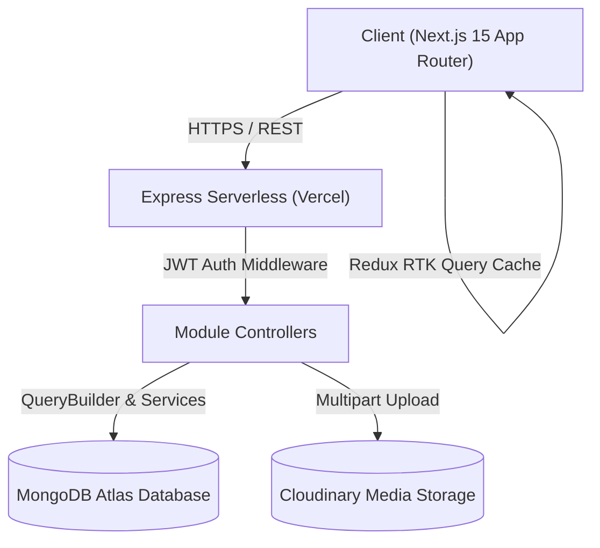

# 🍽️ PlateShare — Full-Stack Recipe Sharing & Culinary Community Platform

[](https://nextjs.org/)
[](https://www.typescriptlang.org/)
[](https://react.dev/)
[](https://tailwindcss.com/)
[](https://redux-toolkit.js.org/)
[](https://nodejs.org/)
[](https://www.mongodb.com/)
[](https://plate-share.vercel.app)
[](LICENSE)

> **PlateShare** is a modern, responsive full-stack culinary platform connecting food enthusiasts, amateur home cooks, and professional chefs to discover, create, bookmark, and share recipes and culinary stories worldwide.

---

## 📌 Table of Contents

- [Live Demo & Deployments](#-live-demo--deployments)
- [Key Features](#-key-features)
- [Tech Stack](#-tech-stack)
- [Architecture & System Design](#-architecture--system-design)
- [Prerequisites](#-prerequisites)
- [Installation & Local Setup](#-installation--local-setup)
- [Environment Variables](#-environment-variables)
- [Running Locally](#-running-locally)
- [Project Folder Structure](#-project-folder-structure)
- [API Documentation](#-api-documentation)
- [Available Scripts](#-available-scripts)
- [Demo Credentials](#-demo-credentials)
- [Contributing](#-contributing)
- [License](#-license)
- [Author & Contact](#-author--contact)

---

## 🌐 Live Demo & Deployments

| Component | Production URL | Status |
| :--- | :--- | :--- |
| **Frontend Web App** | [https://plate-share.vercel.app](https://plate-share.vercel.app) | 🟢 Live |
| **Backend API** | [https://plate-share-server-three.vercel.app/api/v1](https://plate-share-server-three.vercel.app/api/v1) | 🟢 Live |

---

## ✨ Key Features

### 🍳 Recipe Discovery & Management
- **Full Recipe CRUD**: Create, read, update, and delete recipes with dynamic ingredient lists and step-by-step cooking instructions.
- **Direct Cloudinary Image Upload**: Drag-and-drop or click to upload dish cover photos directly to Cloudinary with live preview, with optional image URL fallback.
- **Smart Filtering & Search**: Instant client and server search across titles, descriptions, categories (`BREAKFAST`, `LUNCH`, `DINNER`, `SNACKS`, `DESSERT`), and dietary types (`VEG`, `NON_VEG`, `VEGAN`).
- **Interactive Voting & Ratings**: Real-time upvoting, downvoting, and user feedback system.

### 🤖 Smart AI Pantry Matcher
- **"What's in Your Fridge?" Tool**: Select ingredients you have on hand to find recipes and substitute missing items.

### 📚 Culinary Blog & Articles
- **Full Blog Authoring**: Author, edit, delete, and read articles with category filtering, tag classification, and Cloudinary cover photos.

### 🔖 Saved Cookbook (Bookmarks)
- **Personal Recipe Bookmarking**: 1-click save/unsave recipes with compound indexing on MongoDB ensuring duplicate-free collections.

### 🛡️ Role-Based Access & Admin Moderation
- **Admin Dashboard**: Live platform analytics (Total Users, Active Admins, Total Recipes, Total Blogs).
- **User Management**: Promote/demote user roles (`USER` ↔ `ADMIN`) and block/unblock accounts (`ACTIVE` ↔ `BLOCKED`).
- **Content Moderation**: Moderate, delete, or inspect published recipes and blog posts across the entire platform.

### 🔑 1-Click Demo Login
- Instant **Demo Admin** and **Demo User** credentials cards on the `/login` page for fast review without manual sign-up.

---

## 🛠️ Tech Stack

### Frontend
- **Framework**: [Next.js 15+](https://nextjs.org/) (App Router, Turbopack)
- **Language**: [TypeScript](https://www.typescriptlang.org/)
- **UI & Styling**: [Tailwind CSS 4.0](https://tailwindcss.com/), [Shadcn UI](https://ui.shadcn.com/), [Radix UI](https://www.radix-ui.com/)
- **State Management**: [Redux Toolkit](https://redux-toolkit.js.org/) with **RTK Query** (Cache invalidation, tag management)
- **Forms & Validation**: [React Hook Form](https://react-hook-form.com/), [Zod](https://zod.dev/)
- **Icons & Notifications**: [Lucide React](https://lucide.dev/), [Sonner](https://sonner.emilkowal.ski/)
- **HTTP Client**: [Axios](https://axios-http.com/) with JWT interceptor

### Backend
- **Runtime**: [Node.js](https://nodejs.org/) & [Express.js](https://expressjs.com/)
- **Language**: [TypeScript](https://www.typescriptlang.org/)
- **Database & ODM**: [MongoDB Atlas](https://www.mongodb.com/atlas) with [Mongoose](https://mongoosejs.com/)
- **Authentication**: JWT (JSON Web Tokens), BCrypt password hashing, Cookie Parser
- **File Uploads**: [Multer](https://github.com/expressjs/multer) & [Cloudinary](https://cloudinary.com/) (`multer-storage-cloudinary`)
- **Validation**: [Zod](https://zod.dev/) schema validation middleware

---

## 🏗️ Architecture & System Design



---

## 📋 Prerequisites

Make sure you have the following installed on your machine:
- **Node.js**: `v18.17.0` or higher (Node `v20+` recommended)
- **npm** or **yarn** / **pnpm**
- **MongoDB Database**: Local MongoDB instance or MongoDB Atlas Connection URI
- **Cloudinary Account**: Cloud Name, API Key, and API Secret

---

## ⚙️ Installation & Local Setup

### 1. Clone the Repositories

```bash
# Clone the Frontend repository
git clone https://github.com/Utsho11/plate-share.git

# Clone the Backend repository
git clone https://github.com/Utsho11/plateShare-server.git
```

### 2. Backend Setup

```bash
cd plateShare-server

# Install dependencies
npm install

# Setup environment variables (create .env file)
cp .env.example .env
```

### 3. Frontend Setup

```bash
cd ../plate-share

# Install dependencies
npm install

# Setup environment variables (create .env file)
cp .env.example .env
```

---

## 🔐 Environment Variables

### Backend (`plateShare-server/.env`)

```env
NODE_ENV="development"
PORT=5000
MONGODB_URI="mongodb+srv://<username>:<password>@cluster0.mongodb.net/plateShareDB?retryWrites=true&w=majority"
BCRYPT_SALT_ROUNDS=12
JWT_ACCESS_SECRET="your_jwt_access_secret_key_here"
JWT_ACCESS_EXPIRES_IN="30d"
JWT_REFRESH_SECRET="your_jwt_refresh_secret_key_here"
JWT_REFRESH_EXPIRES_IN="30d"
ADMIN_EMAIL="admin@gmail.com"
ADMIN_PASSWORD="password123"
ADMIN_PROFILE_PHOTO="https://images.unsplash.com/photo-1534528741775-53994a69daeb?w=200"
ADMIN_MOBILE_NUMBER="01700000000"
CLOUDINARY_CLOUD_NAME="your_cloudinary_cloud_name"
CLOUDINARY_API_KEY="your_cloudinary_api_key"
CLOUDINARY_API_SECRET="your_cloudinary_api_secret"
FRONTEND_URL="http://localhost:3000"
```

### Frontend (`plate-share/.env`)

```env
# Point to local server or live Vercel API
NEXT_PUBLIC_BACKEND_API_URL="http://localhost:5000/api/v1"
```

---

## 🚀 Running Locally

### Start Backend Server

```bash
cd plateShare-server
npm run dev
```
*Backend runs on: `http://localhost:5000`*

### Start Frontend Application

```bash
cd plate-share
npm run dev
```
*Frontend runs on: `http://localhost:3000`*

---

## 📁 Project Folder Structure

```text
plate-share/ (Frontend)
├── src/
│   ├── app/
│   │   ├── (withCommonLayout)/     # Public layouts & pages (Home, Blog, Saved, Recipes)
│   │   ├── (withDashboardLayout)/  # Protected role-based dashboard pages
│   │   │   ├── dashboard/admin/    # Admin user moderation & blog control
│   │   │   ├── dashboard/user/     # User recipe & blog CRUD workspaces
│   │   ├── login/                  # Sign-in page with 1-Click Demo Login
│   │   ├── register/               # User registration page
│   │   └── globals.css             # Harmonized brand CSS tokens & dark theme
│   ├── components/                 # Reusable UI, Forms, Recipe cards, Skeletons
│   ├── redux/                      # Redux store & RTK Query API slices
│   ├── services/                   # Auth actions & token helpers
│   └── types/                      # TypeScript interfaces & definitions
├── next.config.ts                  # Next.js build & image optimizations
└── package.json

plateShare-server/ (Backend)
├── src/
│   ├── app/
│   │   ├── config/                 # Cloudinary, Multer, and environment config
│   │   ├── middlewares/            # Auth, validation, error handling, file parsing
│   │   ├── modules/                # Domain-Driven Modules
│   │   │   ├── Auth/               # Login, Register, Refresh token
│   │   │   ├── User/               # User CRUD, profile, status & role management
│   │   │   ├── Recipe/             # Recipe CRUD, author recipes, status updates
│   │   │   ├── Blog/               # Blog CRUD & content moderation
│   │   │   ├── Bookmark/           # Recipe bookmarks & personal cookbook
│   │   │   ├── Stats/              # Platform statistics
│   │   │   ├── Comment/            # Recipe comments
│   │   │   └── Vote/               # Recipe upvoting/downvoting
│   │   ├── routes/                 # Central router index
│   │   └── utils/                  # DB Seeder, JWT verifier, catchAsync
│   ├── api/index.ts                # Vercel serverless entrypoint handler
│   ├── app.ts                      # Express app configuration & CORS
│   └── server.ts                   # Local Express server bootstrap
├── vercel.json                     # Vercel serverless build config
└── package.json
```

---

## 📡 API Documentation

### Base URL: `https://plate-share-server-three.vercel.app/api/v1`

| Module | Method | Endpoint | Access | Description |
| :--- | :--- | :--- | :--- | :--- |
| **Auth** | `POST` | `/auth/register` | Public | Register new user account |
| **Auth** | `POST` | `/auth/login` | Public | Authenticate user & issue JWT |
| **Auth** | `POST` | `/auth/refresh-token` | Public | Refresh access token |
| **Users** | `GET` | `/users` | Admin | Get all users with status |
| **Users** | `GET` | `/users/me` | Authenticated | Get current authenticated user |
| **Users** | `PATCH` | `/users/change-status/:id`| Admin | Change user status (`ACTIVE`/`BLOCKED`) |
| **Users** | `PATCH` | `/users/change-role/:id` | Admin | Change user role (`USER`/`ADMIN`) |
| **Recipes** | `GET` | `/recipe` | Public | Get all recipes (search, filter, sort) |
| **Recipes** | `GET` | `/recipe/:id` | Public | Get single recipe details |
| **Recipes** | `GET` | `/recipe/my-recipes` | Authenticated | Get recipes created by current user |
| **Recipes** | `POST` | `/recipe/create` | Authenticated | Create recipe with Cloudinary files |
| **Recipes** | `PATCH` | `/recipe/update/:id` | Author / Admin | Update recipe details & cover photo |
| **Recipes** | `DELETE`| `/recipe/:id` | Author / Admin | Soft-delete a recipe |
| **Blogs** | `GET` | `/blog` | Public | Get all culinary blog articles |
| **Blogs** | `GET` | `/blog/:id` | Public | Get single blog article |
| **Blogs** | `POST` | `/blog/create` | Authenticated | Create blog article with Cloudinary upload |
| **Blogs** | `PATCH` | `/blog/update/:id` | Author / Admin | Update blog article |
| **Blogs** | `DELETE`| `/blog/delete/:id` | Author / Admin | Soft-delete blog post |
| **Bookmarks**| `POST`| `/bookmark/toggle/:recipeId`| Authenticated | Save / remove recipe bookmark |
| **Bookmarks**| `GET` | `/bookmark/my-bookmarks` | Authenticated | Get user's saved cookbook |
| **Bookmarks**| `GET` | `/bookmark/my-bookmark-ids` | Authenticated | Get user's bookmarked recipe IDs |
| **Stats** | `GET` | `/stats` | Authenticated | Get platform counts & analytics |

---

## 📜 Available Scripts

### Frontend (`plate-share`)
- `npm run dev`: Starts the development server with Turbopack on `http://localhost:3000`.
- `npm run build`: Compiles and optimizes production build.
- `npm run start`: Starts the Next.js production server.
- `npm run lint`: Runs ESLint checks.

### Backend (`plateShare-server`)
- `npm run dev`: Starts the server with hot-reloading via `ts-node-dev`.
- `npm run build`: Compiles TypeScript to JavaScript in `/dist`.
- `npm run start`: Runs compiled production server (`node ./dist/server.js`).
- `npm run seed`: Manually triggers demo database seeding.

---

## 🔑 Demo Credentials

You can test all platform roles immediately using the **1-Click Login buttons** on the login page:

| Account | Email | Password | Role / Permissions |
| :--- | :--- | :--- | :--- |
| 👑 **Demo Admin** | `admin@gmail.com` | `password123` | Full admin rights, moderation, analytics |
| 👨‍🍳 **Demo User** | `user@gmail.com` | `password123` | Recipe CRUD, Blog CRUD, Cookbook, Meal planner |

---

## 🤝 Contributing

Contributions are welcome! Follow these steps to contribute:

1. **Fork the Repository**
2. **Create a Feature Branch** (`git checkout -b feature/AmazingFeature`)
3. **Commit your Changes** (`git commit -m 'feat: Add some AmazingFeature'`)
4. **Push to the Branch** (`git push origin feature/AmazingFeature`)
5. **Open a Pull Request**

---

## 📄 License

This project is licensed under the **MIT License** — see the [LICENSE](LICENSE) file for details.

---

## 📬 Contact & Author

- **Author**: Utsho Roy
- **GitHub**: [@Utsho11](https://github.com/Utsho11)
- **Project Link**: [https://github.com/Utsho11/plate-share](https://github.com/Utsho11/plate-share)
- **Live Application**: [https://plate-share.vercel.app](https://plate-share.vercel.app)
